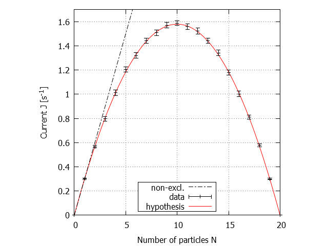

# circle flow

Suppose a 1D chain of sites.
Each site can be occupied by either one or zero particles.
The neighbouring sites are coupled, i.e. particles can hop between the sites with given rates.
This can be viewed as a microscopic tight-binding model of one-channel electron transport.
Instead of two terminals, we assume a periodic boundary condition (hence the circular geometry).
This is advantageous due to the conserved number of particles in the system.

We select the number of sites $S$, the initial occupations (fixing the number of particles $N$),
and the rates for $w^+$ and $w^-$ for the clockwise and counter-clockwise directions, respectively.
The bias $b = w^+ - w^-$ can be interpreted as an effect of external electric field or another potential gradient (never mind the circular geometry).

The transitions between sites are a random Poisson process.
The numbers of transitions in a time interval $t$ are expected to be $n^+(t) = w^+t$, $n^-(t) = w^-t$.
Therefore the mean total flow (or current) of particles is
```math
J_1 = \frac{n(t)}{t} = w^+ - w^- = b
```
We note that the current, as a difference of two Poisson processes, does not follow the Poisson distribution itself (Skellam distribution).

Furthermore, this current expectation is true only if the adjacent sites are empty.
If an adjacent site is occupied, the transition rate becomes zero.
Due to this mutual interaction (e.g. through the charging energy or the Coulomb blockade; or the Pauli exclusion principle in occupied orbitals),
the particles' transitions between sites are **not independent** processes.
Solving such a system is a non-trivial task.

This is where a Monte Carlo simulation steps in, owing to its relative simplicity.

## Monte Carlo simulation

The transition times are sampled from the exponential probability distribution, with the probability densities:
```math
p^+(t) = w^+ e^{-w^+t}
```
```math
p^-(t) = w^- e^{-w^-t}
```
if the adjacent site in given direction is free, zero otherwise.

During the simulation, we count the transitions in the two directions $n^+$, $n^-$.
The current (in the clockwise direction) is defined as
```math
J = \frac{n^+ - n^-}{t}
```
We use the Welford's online algorithm to keep track of the current $J$, yielding its *sample mean* value and the *sample variance* $\sigma^2$.
This standard deviation $\sigma$ is related to the statistics of the ensemble, describing the confidence interval of the sample mean value.
It has nothing to say about current fluctuations.
What the result $J \pm \sigma$ does say is:
the *true* mean current $\tilde{J}$ lies within the interval $(J-\sigma, J+\sigma)$ with 68.2 % *likelihood*.
The variance scales with the number of samples as: $\sigma^2 \sim 1/n$.

### results

parameters:
- $S=20$
- $w^+ = 0.9 \rm{s}^{-1}$
- $w^- = 0.6 \rm{s}^{-1}$

| number of particles $N$ | current $J$ | sample variance $\sigma$ | events sampled | notes |
| - | - | - | - | - |
| 0 | 0 | - | - | |
| 1 | 0.302 | 0.003 | 200k | $J \approx b = 0.3$ |
| 2 | 0.567 | 0.006 | 200k | $J \neq 2b = 0.6$ (the difference is more than $5\sigma$) |
| 3 | 0.796 | 0.009 | 200k | $J \neq 3b = 0.9$ |
| 4 | 1.012 | 0.011 | 200k | |
| 5 | 1.204 | 0.011 | 250k | |
| 6 | 1.321 | 0.012 | 300k | |
| 7 | 1.443 | 0.011 | 400k | |
| 8 | 1.509 | 0.012 | 400k | |
| 9 | 1.570 | 0.012 | 400k | |
| 10 | 1.587 | 0.009 | 660k | $J \neq N b = 3.0$<br>$N=S/2$, maximum current<br>*joint maximum* of the number of particles *and* free sites $N(S-N)$ |
| 11 | 1.559 | 0.012 | 400k | |
| 12 | 1.523 | 0.012 | 400k | |
| 13 | 1.443 | 0.011 | 400k | |
| 14 | 1.342 | 0.012 | 300k | |
| 15 | 1.179 | 0.011 | 250k | |
| 16 | 1.003 | 0.011 | 200k | |
| 17 | 0.810 | 0.009 | 200k | |
| 18 | 0.579 | 0.006 | 200k | |
| 19 | 0.299 | 0.003 | 200k | $J \approx b$<br>$N=S-1$, equivalent model: one *hole* quasi-particle moving in the opposite direction. |
| 20 | 0 | - | - | |

| plot | description |
| - | - |
|  | Plot: the dependence of current $J$ on number of particles $N$ in the system for a fixed number of sites $S=20$ and bias $b=0.3 s^{-1}$.<br><br>The error bars on data show the confidence interval of $\pm 2 \sigma$.<br><br>Based on the results, we formulate a hypothesis: a model explaining the data<br><br>non-excl. model shows the current of $N$ non-exclusive (independent, non-interacting) particles.<br><br>We observe the particle&ndash;hole symmetry. |

The hypothesis is that the mean current $\tilde{J}$ is given by:
```math
\tilde{J} = Nb\frac{S-N}{S-1}
```
The idea behind this model is that each of $N$ particles travels with rate $b$ if the neighbouring sites are vacant.
The probability that, at any time, the neighbouring site is vacant is given by the total number of vacancies $S-N$ dispersed over all of the remaining $S-1$ sites.

What is the likelihood of this hypothesis being correct, provided the data?

## statistical hypothesis testing

A hypothesis cannot be proven. At most, we may not find sufficient evidence to refuse it.

In order to test our *null* hypothesis, first, we select a *level of confidence* $\alpha$. Let us select
```math
\alpha = 0.05
```
This means that we shall refuse the hypothesis,
if the data falls within the most extreme 5 % of the assumed distribution (in both tails).
In other words, we are accepting a 10 % chance of *wrongly refusing* a good hypothesis,
simply because 10 % of possible outcomes lie outside the confidence interval.

The assumed distribution is normal. We rely on a large number of samples (here $\approx 10^5$),
so there is no need for the exact Student's t-distribution,
nor for the actual (unknown) distribution of the complex random process.
This approach is characteristic in the field of statistical physics.

Then, for a given number of particles $N$, we compare the mean values of $J$ and $\tilde{J}$,
and see how far apart (in terms of $\sigma$) these values are:
```math
t = \frac{J-\tilde{J}}{\sigma}
```
Again, $\sigma^2$ is the sample variance of $J$, by which we approximate the true variance of $\tilde{J}$, for we don't know any better.

Finally, we compare $t$ with the critical value $t_c(\alpha)$,
the $\alpha$-quantile of the normal distribution (in terms of $\sigma$):
```math
t_c(\alpha=0.05) = 1.645
```
If $|t| > t_c$, we refuse the hypothesis, as the evidence lies outside the confidence interval.

> The overall idea is the following: we *assume* that the null hypothesis is true.
> Furthermore, we *assume* the normal distribution of the measured current with mean $\tilde{J}$ and variance $\sigma^2$.
> Then we ask: what is the probability of sampling a point (from the *assumed* distribution) at least as extreme as the given data point $J$?
> If the probability is too small, it is a hint that some of our *assumptions* may be incorrect.
> Typically, this would be the one about the null hypothesis being true...

### results

| $N$ | $J$ | $\sigma$ | $\tilde{J}$ | abs $(t)-t_c$ |
| - | - | - | - | - |
| 1 | 0.302 | 0.003 | 0.3 | -1.0 |
| 2 | 0.567 | 0.006 | 0.568 | -1.4 |
| 3 | 0.796 | 0.009 | 0.805 | -0.6 |
| 4 | 1.012 | 0.011 | 1.011 | -1.5 |
| 5 | 1.204 | 0.011 | 1.184 | +0.15 :red_circle: |
| 6 | 1.321 | 0.012 | 1.326 | -1.2 |
| 7 | 1.443 | 0.011 | 1.437 | -1.1|
| 8 | 1.509 | 0.012 | 1.516 | -1.1|
| 9 | 1.570 | 0.012 | 1.563 | -1.1|
| 10 | 1.587 | 0.009 | 1.579 | -0.8 |
| 11 | 1.559 | 0.012 | 1.563 | -1.3 |
| 12 | 1.523 | 0.012 | 1.516 | -1.0 |
| 13 | 1.443 | 0.011 | 1.437 | -1.1 |
| 14 | 1.342 | 0.012 | 1.326 | -0.3 |
| 15 | 1.179 | 0.011 | 1.184 | -1.2 |
| 16 | 1.003 | 0.011 | 1.011 | -1.0 |
| 17 | 0.810 | 0.009 | 0.805 | -1.1 |
| 18 | 0.579 | 0.006 | 0.568 | +0.11 :red_circle: |
| 19 | 0.299 | 0.003 | 0.3 | -1.3 |

In two cases, namely $N=5$ and $N=18$, we refuse the hypothesis. So we should discard the hypothesis altogether. Or not?

What we did wrong: we tested the hypothesis independently 19 times,
each time with the level of confidence $\alpha=0.05$ (10 % chance of refusing a good hypothesis).
However, by checking the binomial distribution, we find that the overall chance of refusing a good hypothesis is not 10 %,
but 86.5 % (the probability of refusing it at least once out of 19 trials).
So the hypothesis was pretty much doomed even before we started testing it.
If we wanted to set the overall confidence to 10 %,
it would require $\alpha=0.006$ ($t_c=2.512$), which follows, again, from the binomial distribution.
On the other hand, we need to bear in mind: are we really testing the same hypothesis each time?

### conclusion

We conclude that, statistically,
the difference between the data $J$ (simulation) and the model $\tilde{J}$ (hypothesis) is **not significant**,
at the level of confidence $\alpha=0.05$. We keep the hypothesis.
